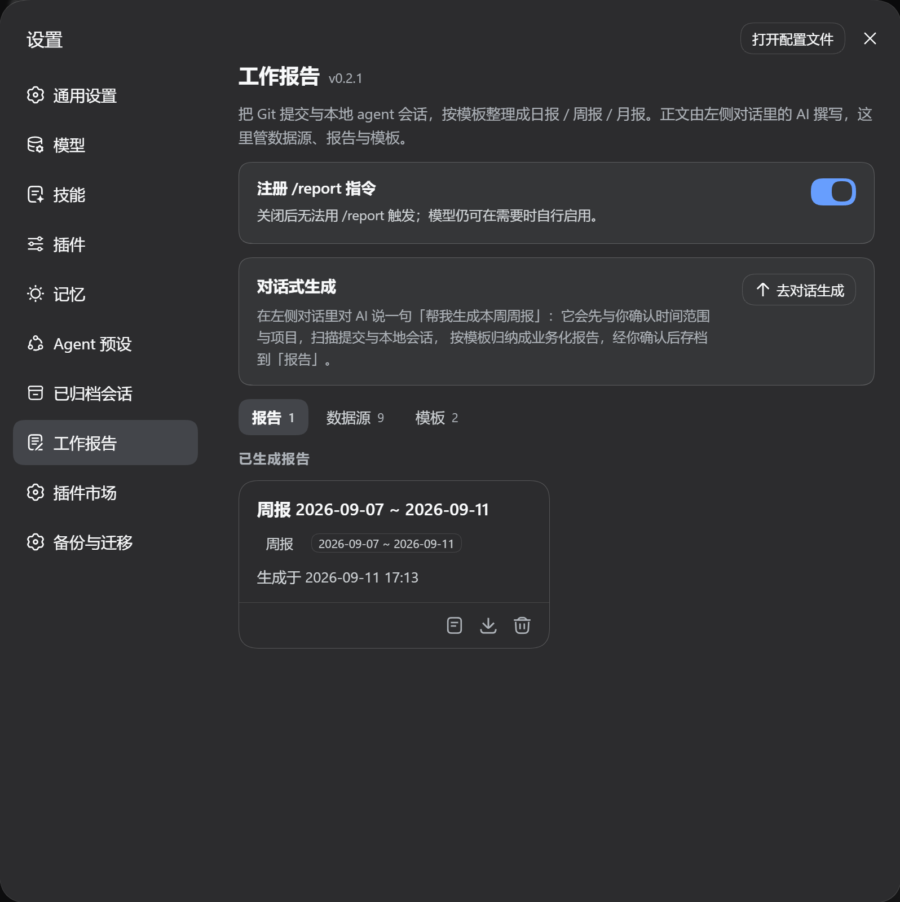

# @zzerx/dsh-plugin-daily-log

工作日报告插件：把 **Git 提交**与**本地 agent 对话**（DeepSeek / Claude / Codex）汇总起来，按你自己的模板生成日报 / 周报 / 月报。不只面向开发者——只有本地对话记录，同样能出一份工作总结。



## 安装

```bash
dsh plugin --profile <你的 profile 名> add @zzerx/dsh-plugin-daily-log
```

入口：**设置 → 工作报告**（一级分区，内含 报告 / 数据源 / 模板 三个页签）。

## 怎么用

在会话里说出需求即可，例如「帮我生成本周周报」：agent 先与你确认时间范围与项目，再扫描 Git 提交与本地 agent 对话，按模板章节把活动归纳成业务化报告，你确认后存进报告历史，可一键导出 `.md`。

| 方式 | 说明 |
|---|---|
| 敲 `/report 生成这周的周报` | 指令把你这句话续成一条用户消息交给模型，**不用重述需求**。注意要带需求：裸敲 `/report` 不产生模型轮次，那一轮自然也没有可投递引导的通道。 |
| 直接说「帮我生成本周周报」 | 模型自己启用整组工具，再走上面的流程。 |

## 能做什么

- **多源采集**：Git 仓库（`git log`）、Claude Code、Codex、DeepSeek harness 的会话记录。
- **报告历史 + 导出**：历史报告可查看 / 删除，一键导出 `.md` 到本地目录。
- **默认只统计本人提交**：Git 渠道按提交身份过滤（项目级 `author` > 设置里的邮箱 > 仓库的 `git config user.email`）；填 `*` 或 `all` 放开全作者。对话渠道没有作者维度，不受影响。
- **控制上下文占用**：扫描默认只给分组级索引（渲染行数只与「会话 / 分支」数量有关，与被折叠的消息条数无关），要看细节再取摘要或逐条明细；被折叠的分组会**显式列出名称与条数**，不会静默丢弃。
- **剥离注入内容**：宿主往会话里塞的包裹块（打开 / 选中的文件、环境与权限说明、AGENTS.md 提示、命令回显、任务通知）在解析阶段剥离，只按白名单标签匹配，正文里的普通尖括号内容不会被误伤。

## 模板

模板是「指令段（可选） + `<!-- DATA -->` + 骨架段」的 Markdown：两段都作为结构引导注入生成阶段，AI 按骨架章节撰写正文（不是占位符替换）。内置 default 提供五节骨架（核心产出 / 问题修复 / 技术优化 / 其他工作 / 下一步计划）；模板页可创建 / 编辑自定义模板。

## agent 工具

工具**默认不进模型上下文**：新会话只挂 1 个常驻派发器 `daily_log`；需要时才把 15 个 `daily_log_*` 工具注入本会话，启用后在该会话内保持可见，不跨会话泄漏。设置里的「注册 /report 指令」只管这个指令是否注册（默认开，关掉后模型仍可自行启用整组工具）。

## 开发

```bash
pnpm --filter @zzerx/dsh-plugin-daily-log typecheck   # tsc --noEmit
pnpm --filter @zzerx/dsh-plugin-daily-log build       # lib/index.js + lib/client.js + lib/types
```

## License

MIT
