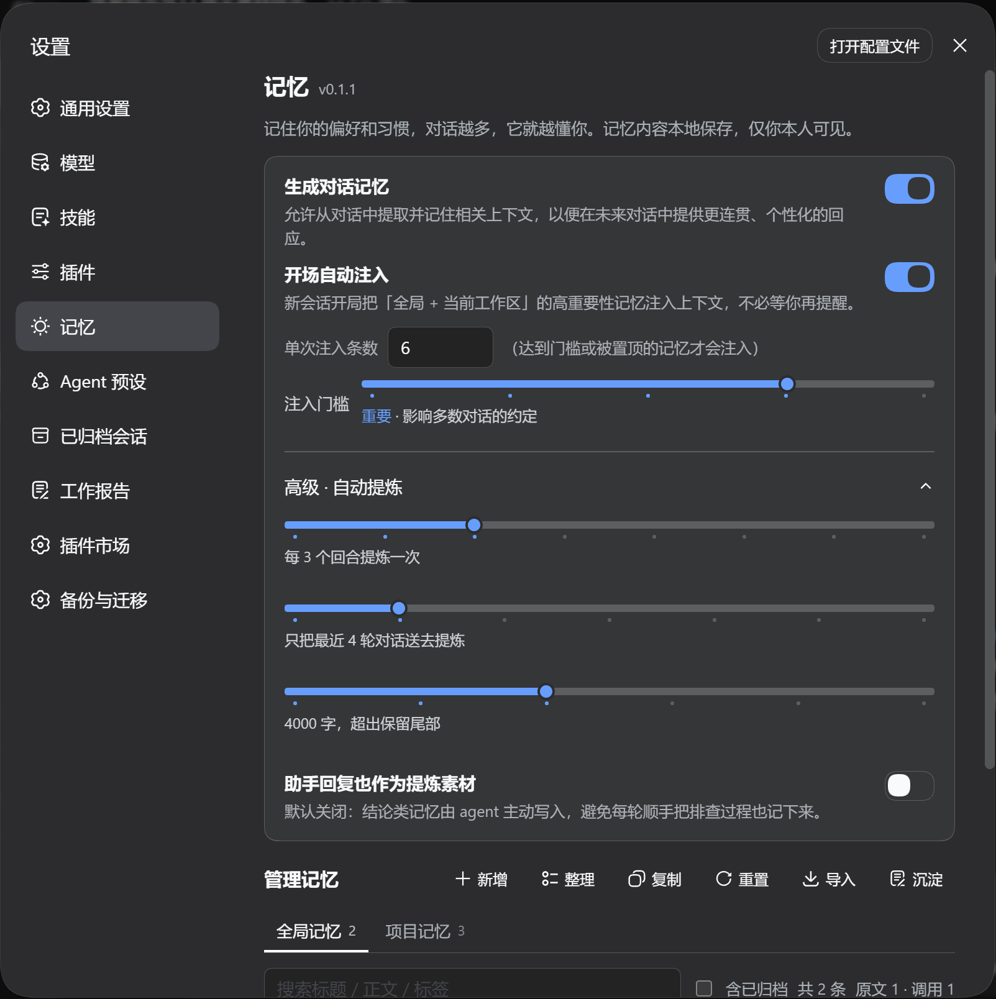

# @zzerx/dsh-plugin-memory

dsh 的**记忆**插件：跨会话记住你的偏好、身份与项目决策，对话越多它越懂你。记忆只存在本地。入口是**设置面板里的一级「记忆」分区**。



## 安装

```bash
dsh plugin --profile <你的 profile 名> add @zzerx/dsh-plugin-memory
```

## 能做什么

| 能力 | 说明 |
|---|---|
| **生成对话记忆** | 开关打开后，每轮对话结束时用会话自己的模型提炼值得长期记住的内容（偏好、身份、项目决策、经验），自动入库。 |
| **全局 / 项目双作用域** | 普适的东西（语气、格式、身份、职业、广泛偏好）进**全局**；只对某个工作区成立的习惯与决策进**项目**（以工作区目录路径为键）。 |
| **开场自动注入** | 新会话开局把「全局 + 当前工作区」的高重要性记忆注入，不必每次重新提醒。 |
| **管理记忆** | 工具条只留「新增 / 沉淀 / 更多 ▾」，整理、重建关联、复制导出、导入、重置都收在「更多」下拉里；查看、编辑、置顶、归档、删除、移动作用域；每条可开详情（分类 / 重要性 / 来源 / 创建与更新时间 / 标签 / 来源会话）。 |
| **导入其他 AI 的记忆** | 内置一段提示词，复制到别的 AI 里整理出个人画像，把结果粘回来即可按分类拆条入库。 |
| **原文留档，失败不丢** | 原始文本先落盘再抽条目：模型抽不出、调用失败、JSON 非法，原文都还在，之后可以用更好的解析器对同一份原文**重抽**。 |
| **留档与审计** | 面板「沉淀」里可看原文留档与每次后台模型调用（用途 / 模型 / 耗时 / 抽出的条目数 / 失败原因），抽不出来也不丢原文。 |
| **整理（进化）** | 同作用域 + 同分类 + 同标题的重复条目合并，正文与标签取并集，保留信息最完整的一条。 |
| **实体与关联（wiki 图层）** | 记忆不是孤岛：写记忆时声明实体（项目 / 工具 / 人 / 概念），实体名出现在标题或标签 = 一条「关于」边，只出现在正文 = 「提及」边；共享同一实体的两条记忆自动连成「相关」（权重 = 共享实体数）。关系本身有信息量时（细化 / 取代 / 冲突 / 属于 / 使用 / 同义）可以让模型或你在面板里显式连边。 |
| **记忆图谱** | 「更多 ▾ → 记忆图谱」打开一张可拖动、可缩放的关系图：节点是记忆加全部实体，连线是它们之间真实存在的关系（自动生成的共现边画成虚线）。弹窗里可直接在**全局 / 项目**之间切换（选项目时还能挑具体工作区），不用退出去换页签。悬停看细节，点记忆节点开它的详情——详情浮在图谱上，图谱不关；记忆超过 500 条时只画关联最多的那些，并在图上方注明省略了几条。 |
| **别名（redirect）** | 同一条记忆的别的说法写进 aliases：之后用别名当标题写入会自动并进那一条，不会长出重复条目（wiki 的 redirect 语义）。 |
| **写入去重三件套** | ① 阈值：正文相似度（bigram Dice）≥ 0.7 或标题 ≥ 0.9 自动并入已有条目；② 疑似提示：没到线但 ≥ 0.4 时，写入结果里带一条「疑似同一条」提醒（给出目标与相似度，并说明改/删/连的处置）；③ 写入判定：附近有 ≥ 0.2 的候选时，让模型判一次 `add / update / skip` —— `update` 并进目标、`skip` 不写、拿不到路由或超时一律退化成新建。这是默认行为、没有开关；批量导入不判定。 |
| **9 个模型工具** | 让 agent 自己存取记忆与连线（见下）。 |

## agent 工具

| 工具 | 用途 |
|---|---|
| `memory_save` / `memory_search` / `memory_list` | 保存（可带 summary / aliases / entities）、搜索、列举 |
| `memory_update` / `memory_archive` / `memory_delete` / `memory_move` | 修改、归档（软隐藏）、删除、改作用域 |
| `memory_entity` | 落实体（项目 / 工具 / 人 / 组织 / 概念）、按关键字列实体、删实体（连同它的边） |
| `memory_link` | 连一条有语义的边、断边、看某条记忆的全部关联（含自动边） |

作用域由模型判定（参数必填），判错了可以在面板里或让模型用 `memory_move` 改。

## 设置与数据

- 开关存在设置命名空间 `forge-studio-memory`，改完即时生效，与插件设置卡片同源。
- 记忆条目、原文留档、后台调用记录、实体与边（entities / edges 两张表）都只存在本地存储里；归档是软隐藏（不进注入与列表，可恢复），删除才是真删。
- 侧栏图标：设置面板的侧栏默认给所有分区一个通用齿轮，本插件用一层 DOM 补丁换成自己的图标；补丁失败只退回齿轮，不影响功能。

## 已知边界

- **不替代会话日志**：只存「值得跨会话记住」的精炼知识。
- **不做向量检索**：检索仍是子串匹配（标题 / 正文 / 摘要 / 别名 / 标签），关系靠实体与边表达；向量召回（embedding）仍是后续增强，不是现在的承诺 —— 现在的语义去重靠「阈值 + 疑似提示 + 写入判定」三件套，判定看的是候选文本，不是向量。
- **写入判定是额外一次模型调用**：只在附近已有相似条目时发起（一次最多 3 条候选、一行 JSON、约 200 token），失败/超时/拿不到路由都退化成「新建」，绝不因为判定丢记忆；每次判定在面板「后台模型调用」里记一条用途为「写入判定」的记录。
- **实体提及是字面匹配**：实体名或别名在文本里出现即算提及（名称至少 2 个字），不做指代消解，也不调用模型。
- **自动提炼是一次额外模型调用**：拿不到模型路由、流失败、JSON 非法都只降级为「这次没记」，绝不影响对话。
- **项目维度的键是工作区目录路径**：同一目录换盘符大小写、改斜杠方向会归一化为同一个项目；改目录名等于换项目。
- **图谱要能画 canvas**：运行环境拿不到 2D 画布（或 echarts 加载失败）时，图谱弹窗里只给一句说明，其余功能不受影响。画图用的 echarts 打进客户端包，会让 `lib/client.js` 涨到约 1.1 MB（gzip 约 350 KB）——客户端包是单文件、不做代码分割，动态加载只推迟执行、不减体积。
- **与其他记忆插件互斥**：注册工具前先探测有没有别的插件已占用 `memory_*` 名字（例如撞上 `dsh-mneme`）。撞名就**硬锁本插件**：不注册工具、不注入、不自动提炼，面板顶部给红色警告并置灰所有开关。两个记忆插件同时跑属于不受支持的组合，不做「部分可用」的半吊子状态；停用另一个并重启即自动解锁。

## 开发

```bash
pnpm --filter @zzerx/dsh-plugin-memory build      # lib/index.js + lib/client.js + lib/types
pnpm --filter @zzerx/dsh-plugin-memory typecheck
```

## License

MIT
