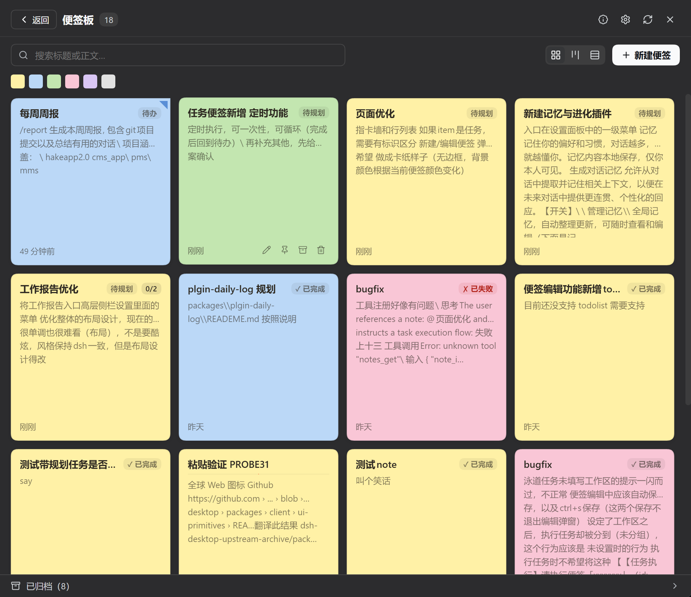
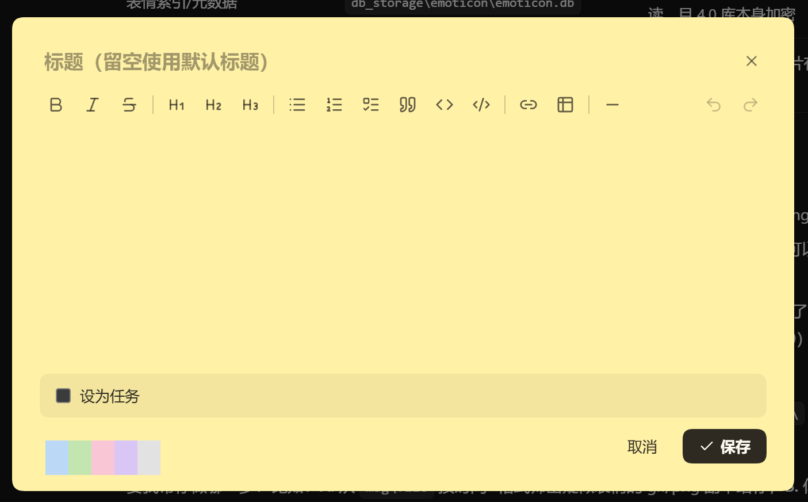
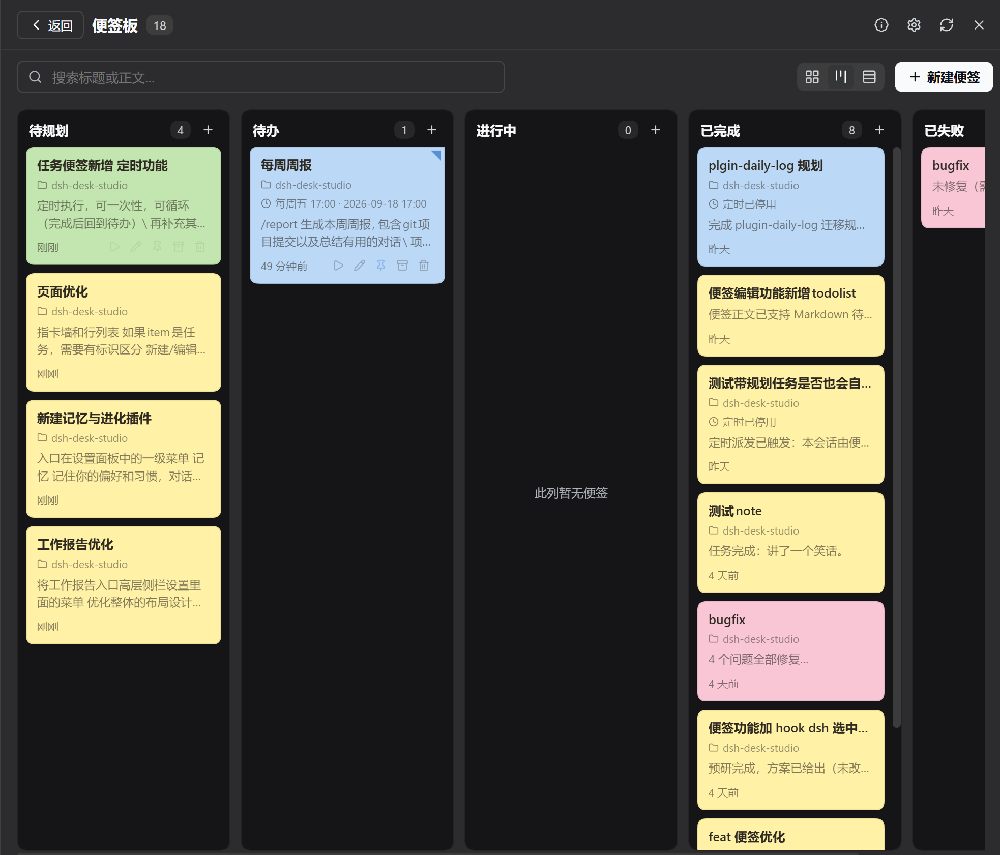

# @zzerx/dsh-plugin-notes

dsh 便签插件：侧栏一个图标打开**便签板**，输入框左下角一条工具条顺手「记一笔 / 打开便签板 / 看待办数」，右侧栏导引页点一下也能把便签板开成标签页。纸卡墙上写 Markdown 便签；需要时把便签变成任务——拖进泳道、交给 AI 执行，或者按日程定时跑。







## 安装

```bash
dsh plugin --profile <你的 profile 名> add @zzerx/dsh-plugin-notes
```

装好后侧栏的图标列出现便签字形（侧栏折叠时只显图标），点它打开便签板；板内右上角 ✕ 或 `Esc` 回到会话。
字形里还挂着**待办数**与**快捷新建 (＋)**，两侧由一根弹簧撑开，渲染出来就是**整行**
`[图标 便签 ......... 待办数 (＋)]`（有待办才显示数字；点 (＋) 只弹快捷新建，不会连带打开便签板）。
这一行是插件**接管**宿主那一行做出来的：槽位只给一个字形位、标题由侧栏自己渲染在字形之后，
所以标题与控件都长在字形里，再靠 CSS 把宿主标题藏掉（判定与失效回退见
`src/client/styles/notes-entry-css.ts`）。

## 入口

便签板本体在**中间列**（侧栏那个字形就是它的开关），也能开在**右侧栏**（导引页那张卡片）。
除此之外还有一组**可选的**增量入口 —— 全部能单独开关，位置在 **dsh 设置 → 便签 → 入口**：

| 入口 | 在哪 |
|---|---|
| 侧栏顶部入口 | 侧边栏顶部那一整行 `[图标 便签 ......... 待办数 (＋)]`，点行打开便签板，点 (＋) 只开快捷新建；关掉即整行消失 |
| 输入栏工具条 | 输入框左下角那一条：记一笔 \| 打开便签板 \| 待办数 |
| 存成便签 | 每条助手回复下方的按钮，把该条回答**带进快捷新建浮层**（预填标题与正文），确认后保存 |
| 右侧栏导引卡片 | 右侧栏导引页里的便签卡片，点一下就在右侧栏以标签页打开便签板 |

默认**核心开、扩展关**：侧栏顶部入口、输入栏工具条、存成便签、右侧栏导引卡片默认开。

**至少要留一个入口**：全关掉之后便签板自己就没有打开的地方了（设置页在 dsh 设置里，不受影响），
所以设置页会把最后一个开着的入口锁住，不让你关。

## 能做什么

- **三种显示模式**：纸卡墙 / 行式列表 / 任务泳道，随时切换，选择会被记住。
- **六色纸卡 + 置顶**：配色与 Win11 便签一致，置顶优先；颜色可多选筛选（只筛活动区）。
- **搜索与归档**：标题 + 正文实时搜索；归档便签收进列表底部折叠区，可恢复 / 编辑 / 删除。
- **大列表不卡**：列表分批渲染，首批 16 条，滚动到底自动续批，也可点「加载更多」。
- **Markdown 正文**：格式工具栏（加粗 / 标题 / 列表 / 任务清单 / 引用 / 代码 / 撤销重做）；任务清单 `- [ ]` 在纸卡与列表上显示完成度徽标（如 `2/5`，全勾变 ✓）。
- **粘贴图片**：编辑器里 `Ctrl+V` 直接把剪贴板里的图片内联进正文。
- **便签变任务**：写入泳道状态即成为任务，五列看板（待规划 → 待办 → 进行中 → 已完成 → 已失败）拖拽换状态；普通便签不进泳道。
- **交给 AI 执行**：任务卡 hover「执行」→ 按该任务的工作区**新开一个会话**跑，便签板所在会话不被占用；完成后摘要回到卡片首行，全文进「任务与结果」区。跑太久可「重置为待办」。
- **定时执行**：一次性 / 间隔 N 分钟 / 每天 / 每周（可多选星期）/ 每月；卡片显示「周期 · 下次时刻」，编辑器显示「下次 / 上次（含跳过原因）」。宿主停机期间错过的时点**不补跑**，上一轮未结束则本轮跳过。
- **自动保存**：编辑既有便签时停顿约 1 秒落盘，页脚有「自动保存 / 已自动保存」指示灯。

## 常用操作

| 操作 | 怎么做 |
|---|---|
| 开关便签板 | 点侧栏的便签图标打开；板内右上角 ✕ 或按 `Esc` 回到会话 |
| 记一笔 | 输入框左下角工具条的「记一笔」，或侧栏便签字形里的 (＋) |
| 在右侧栏开便签板 | 右侧栏导引页点「智能便签」卡片（板子与中间列是同一份数据） |
| 新建便签 | 便签板内新建（新建态只走显式保存，保存即创建） |
| 保存 | `Ctrl+S` 立即保存（不关弹窗）；`Ctrl+Enter` 或「保存」按钮 = 保存并关闭 |
| 插入任务清单 | 工具栏「任务清单」或 `Ctrl+Shift+9`；输入 `- [ ] ` 自动转换，回车续行、`Tab` 缩进成子项 |
| 换状态 | 卡片跨列拖拽 |
| 默认标题 / 默认工作区 | dsh 设置 → 便签 → 基础 |

## 工作区（执行目录）

便签可带一个**工作区**（绝对路径），决定交给 AI 执行时在哪个目录跑。编辑器里从下拉框选（候选 = 最近会话用过的目录，只选不手填；同名只显示文件夹名），留空则三层兜底：设置里的**默认工作区** → 最近会话用过的目录 → 宿主进程目录。

## 设置

设置界面是 **dsh 设置面板里的一级「便签」分区**（左栏「便签」），分三个 tab：
**基础**（默认标题 / 默认工作区）、**入口**（各入口开关）、**备份**（WebDAV）。
便签板内不再有设置入口 —— 设置入口如果长在板子里，入口全关时就会把人锁在设置外面。

命名空间 `forge-studio-notes`：

| 键 | 说明 |
|---|---|
| `defaultTitle` | 新便签的默认标题 |
| `defaultWorkspace` | 默认工作区（执行目录兜底链的第一层） |
| `entry` | 各会话入口的开关（dsh 设置 → 便签 → 入口） |

## agent 工具

宿主装配了 `tools` 服务时注册 8 个工具（纯 UI 宿主不注册，照常使用）：

| 工具 | 用途 |
|---|---|
| `notes_list` / `notes_get` | 列摘要 / 读全文 |
| `notes_create` / `notes_update` / `notes_set_pinned` / `notes_delete` | 新建、修改、置顶、删除 |
| `notes_task_set_status` / `notes_task_report` | 任务置状态 / 收尾写结果 |

权限边界（fail-closed）：

- 新建便签、置顶/归档**不问**——agent 新建的便签恒为它自己的，碰不到你的内容。
- 改或删**你手写的便签**时，工具自己会向你发起一次「同意 / 拒绝」（与 `ask_user_question`
  同一套提问通道，不是权限审批）。因此**与权限模式（approval policy）无关**：任何档位下
  都照常问；同意才落笔，拒绝 / 关掉不答一律不执行。
- 宿主没有审批通道时，agent 只能删它自己创建的便签（便签带来源标记，创建后不可变）。
- 任务工具只在「执行」授权的那次执行会话内可用；你手动改状态或取消任务即收回授权。

## 开发

```bash
pnpm --filter @zzerx/dsh-plugin-notes typecheck   # tsc --noEmit
pnpm --filter @zzerx/dsh-plugin-notes build       # lib/index.js + lib/client.js + lib/types
```

## License

MIT
